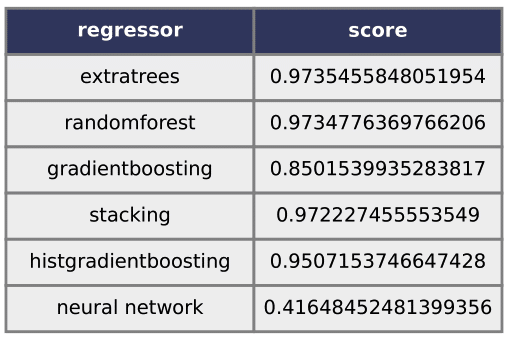

# SA-EDS
Surogate Assistance for the Exploration of DNA Structures
This is the source code of the article "Machine-learning-based prediction of DNA structure volume for Quality-Diversity exploration".

### To clone this repository
```
git clone https://github.com/si-tm/SA-EDS.git
```
### Installation
First, download NUPACK version 4.0.1.8, and put it in the root directory of the local clone of the "SA-EDS" git repository. You can find it on [NUPACK official website](https://www.nupack.org/). Then you will need to install it on your computer:
```
tar xvf nupack-4.0.1.8.tar.gz
cd nupack-4.0.1.8
mkdir build && cd build
cmake .. && make -j 20
make install
```

### Usage
```

```
### Quickstart
After all dependencies are installed (including NUPACK), you should be able to launch the Python scripts of this repository.
```
./scripts/predictVolumeAll.py
./scripts/plotMap.py
```
### with Docker
```
docker build -t sa-eds .
docker run sa-eds
```

## results



### Authors
- Maya Hyakuzuka
    - email: g1920534 "at" is "dot" ocha "dot" ac "dot" jp
- Nathanael Aubert-Kato: Main author and maintainer.
    - ResearchGate
    - email: naubertkato "at" is "dot" ocha "dot" ac "dot" jp

# todo
- rewrite Dockerfile in entrypoint

