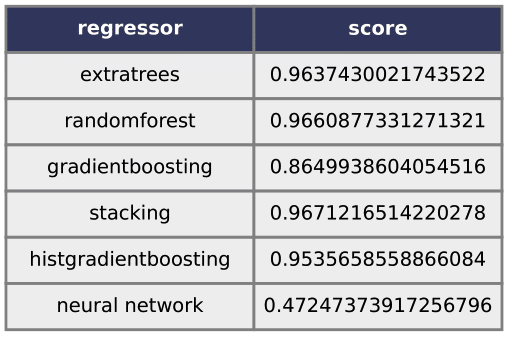

# SA-EDS
Surogate Assistance for the Exploration of DNA Structures
This is the source code of the article "Machine-learning-based prediction of DNA structure volume for Quality-Diversity exploration".

### To clone this repository
```
git clone https://github.com/si-tm/SA-EDS.git
```
### Installation
First, download NUPACK version 4.0.1.8, and put it in the root directory of the local clone of the "SA-EDS" git repository. You can find it on [NUPACK official website](https://www.nupack.org/). Then you will need to install it on your computer:
<!-- ```
tar xvf nupack-4.0.1.8.tar.gz
cd nupack-4.0.1.8
``` -->
Then, the folder `initial` move on this root directory
```
mv ../initial .
```
and then, build this Dockerfile.
<!-- ```
cd oxDNA
mkdir build && cd build
cmake .. && make -j 20
cmake .. && make -j4
``` -->
```
chmod 777 build.sh
./build
```

### Usage

After all dependencies are installed (including NUPACK), you should be able to launch the Python scripts of this repository.
1. make data from results of oxDNA. 
first, download initial.zip and unzip in root directory.
then, 
then this generate `datasete/L{1-3}_data_initial.pkl`
```
./runDocker.sh scripts/reshape.py L1
./runDocker.sh scripts/reshape.py L2
./runDocker.sh scripts/reshape.py L3
```

2. generate surrogate model which predict average of DNA volume.
The figure of results will save as `results/plot_L{1-3}.png`, and the model will be saved in `saved_model`.
```
./runDocker.sh scripts/plotVolume.py L1
./runDocker.sh scripts/plotVolume.py L2
./runDocker.sh scripts/plotVolume.py L3
```

3. based on the surrogate model, we can map the result of Quality Diversity.
results will be saved in `results`.
```
./runDocker.sh scripts/optimize_l1_original_ind_temp_eigen.py 
./runDocker.sh scripts/optimize_l2_original_ind_temp_eigen.py 
./runDocker.sh scripts/optimize_l3_original_ind_temp_eigen.py 
```

## results
### compararison with regressor
  
  
  


### Authors
- Maya Hyakuzuka
    - email: g1920534 "at" is "dot" ocha "dot" ac "dot" jp
- Nathanael Aubert-Kato: Main author and maintainer.
    - [ResearchGate](https://www.researchgate.net/profile/Nathanael-Aubert-Kato)
    - email: naubertkato "at" is "dot" ocha "dot" ac "dot" jp

