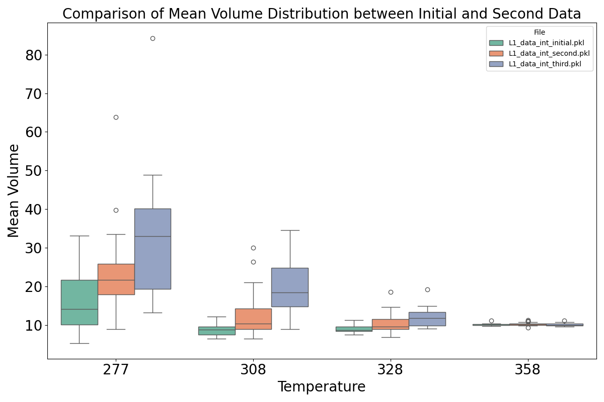
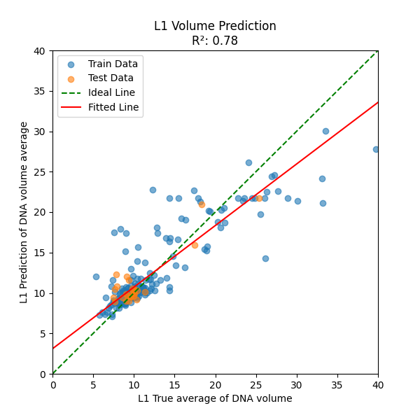

```sh
./runDocker scripts/analyze/volume.py
```
[scripts/analyze/volume.py](scripts/analyze/volume.py)
```py
type_of_l_lst = ["L1", "L2", "L3"]
type_of_l_lst = ["L1", "L2"]
type_of_l_lst = ["L2"]
iteration_lst = ["initial", "second", "third"]
```



command: 
```sh
./runDocker.sh scripts/plot_volume_prediction.py < library type > < target name > < target name >
```
example: 
```sh
./runDocker.sh scripts/plot_volume_prediction.py L3 int_initial int_second
```

